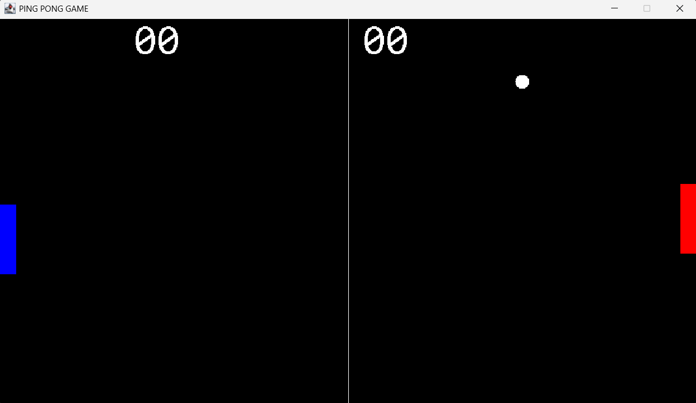

# 🏓 Jeu de Ping Pong en Java (AWT & Swing)

Ce projet est un **jeu de Ping Pong en 2D** développé en **Java** avec les bibliothèques **AWT** et **Swing** pour l’interface graphique.  
Il a été conçu à des fins pédagogiques dans le cadre de ma formation en informatique.

---

## 🎮 Fonctionnalités

- 🕹️ Contrôle du joueur via le clavier
- 💻 mode 2 joueurs
- 🧠 Détection des collisions balle / raquettes / murs
- 🔊 Effets sonores 
- 🏆 Compteur de score en temps réel
- 🎨 Interface graphique simple et fluide (Swing + AWT)

---

## 🛠️ Technologies utilisées

- **Langage** : Java
- **GUI** : AWT & Swing
- **OOP** : Programmation orientée objet

---
